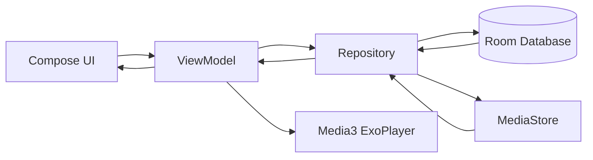

# 🎵 LocalWave (Preview)

A modern offline music player built with **Kotlin**, **Jetpack Compose**, and **Media3** that allows users to browse, play, and manage audio files stored locally on their Android devices.

LocalWave focuses on providing a beautiful, responsive, and distraction-free music listening experience with dynamic album-based theming, favorites management, playback controls, and persistent playback state.

---

# 📚 Table of Contents

- [📱 App Overview](#-app-overview)
- [✨ Features](#-features)
- [🛠 Tech Stack](#-tech-stack)
- [🏗 Architecture](#-architecture)
- [🔄 App Flow](#-app-flow)
- [📸 Screenshots / Demo](#-screenshots--demo)
- [🌐 API Integration](#-api-integration)
- [📂 Project Structure](#-project-structure)
- [🎯 Use Cases](#-use-cases)
- [🚧 Future Improvements](#-future-improvements)
- [🤝 Freelancing & Portfolio](#-freelancing--portfolio)
- [📄 License](#-license)

---

# 📱 App Overview

## What is LocalWave?

LocalWave is an offline Android music player that automatically discovers audio files stored on a device and provides a smooth music playback experience.

The app eliminates the need for subscriptions, internet connectivity, or external services by focusing entirely on locally stored music.

## Problem It Solves

Many modern music apps are heavily dependent on internet connectivity and streaming services.

LocalWave solves this by providing:

- Completely offline music playback
- Fast local song discovery
- Dynamic album artwork experience
- Persistent playback state
- Lightweight and privacy-friendly listening

---

# ✨ Features

### 🎶 Music Playback

- Play local audio files
- Pause and resume playback
- Next / Previous controls
- Seek through songs
- Volume controls

### ❤️ Favorites

- Mark songs as favorites
- Dedicated Favorites screen
- Persistent favorites using Room Database

### 🎨 Dynamic UI

- Album artwork extraction
- Dynamic color palette generation
- Album-based theming
- Animated vinyl record player

### 🔄 Playback Modes

- Shuffle Mode
- Repeat One
- Repeat All
- Repeat Off

### 📱 User Experience

- Mini player
- Bottom sheet music player
- Smooth Compose animations
- Scroll-aware mini-player visibility

### 💾 Persistence

- Playback position restoration
- Last played song restoration
- Favorite songs persistence

### 🔔 Notifications

- Playback notification
- Play/Pause actions
- Next/Previous controls

### 🚀 Performance

- Local storage scanning
- Efficient media loading
- Reactive UI updates

---

# 🛠 Tech Stack

## Language

- Kotlin

## UI

- Jetpack Compose
- Material 3

## Media

- Android Media3
- ExoPlayer

## Architecture

- MVVM Architecture

## Local Storage

- Room Database
- DataStore Preferences

## Android Components

- ViewModel
- Coroutines
- Flow
- MediaSessionService
- BroadcastReceiver

## Libraries

```gradle
Jetpack Compose
Material 3
Media3 ExoPlayer
Media3 Session
Room Database
Kotlin Coroutines
DataStore
Palette API
Navigation Compose
```

---

# 🏗 Architecture

The project follows the **MVVM (Model-View-ViewModel)** architecture.

## Why MVVM?

- Separation of concerns
- Better maintainability
- Easier testing
- Scalable codebase
- Lifecycle-aware state management

## Architecture Diagram



---

# 🔄 App Flow

### 1. App Launch

- User opens LocalWave
- Audio permissions are requested

### 2. Song Discovery

- MediaStore scans local device storage
- Songs are loaded into Repository

### 3. UI Rendering

- ViewModel updates UI state
- Song list is displayed

### 4. Playback

- User taps a song
- ExoPlayer playlist is created
- Playback begins

### 5. Dynamic Theme

- Album art is extracted
- Palette API generates colors
- UI updates dynamically

### 6. Persistence

- Playback position saved
- Last song saved
- Favorites stored in Room

### 7. Restoration

- App relaunch restores:
  - Song
  - Position
  - Playback state

---

# 📸 Screenshots / Demo

## Permission Dialogs

<p align="center">
  
  
</p>

## Music Player

https://github.com/user-attachments/assets/be414911-9333-4410-aa30-c45ba11ab95a

## Favorites Screen

<p align="center">
  
  
</p>

## Dynamic Theme Example

https://github.com/user-attachments/assets/add03101-0f02-46b8-9dc3-6e91bb7a5dbc

## Music Player Screen

https://github.com/user-attachments/assets/be414911-9333-4410-aa30-c45ba11ab95a

https://github.com/user-attachments/assets/3dd2e73a-50e8-458b-9b40-b8019141f96f

## Repeat Mode

https://github.com/user-attachments/assets/bc94dac5-1dc5-493a-9d90-20d144e0e2fd

## Favourite Playlist

https://github.com/user-attachments/assets/b0ae525d-ec1e-4d7a-a575-b518524c67a4

## Notification Player

https://github.com/user-attachments/assets/f673876b-6642-49f6-b78e-fd2cac385c74

## Demo Video

```text
https://youtu.be/3Trru19tWdI
```

---

# 🌐 API Integration

## External APIs

This application currently does **not use any external web APIs**.

Instead it relies on:

### Android MediaStore

Used for:

- Discovering audio files
- Fetching local media content

### MediaMetadataRetriever

Used for:

- Song metadata extraction
- Album artwork extraction
- Artist information
- Album information

### Palette API

Used for:

- Dynamic color generation from album artwork

## Error Handling

- Metadata extraction fallback
- Missing artwork fallback
- Missing title fallback
- Permission handling
- Safe playback restoration

---

## Permissions Required

### Android 13+

```xml
READ_MEDIA_AUDIO
POST_NOTIFICATIONS
```

### Android 12 and Below

```xml
READ_EXTERNAL_STORAGE
```

---

## API Keys

No API keys are required.

The application works entirely offline.

---

# 📂 Project Structure

```text
kush.android.musicplayer
│
├── data
│   ├── DatabaseProvider
│   ├── MusicDatabase
│   ├── FavoriteDao
│   └── MusicRepository
│
├── model
│   ├── SongData
│   ├── FavoriteSong
│   └── MusicUiState
│
├── navigation
│   ├── AppNavigation
│   └── Routes
│
├── player
│   ├── MusicPlayerController
│   ├── MusicPlaybackService
│   ├── MusicNotificationManager
│   ├── MusicActionReceiver
│   └── PlayerPreferences
│
├── utils
│   ├── DynamicColors
│   ├── MetadataHelpers
│   ├── Permissions
│   ├── RepeatMode
│   └── TimeConversion
│
├── view
│   ├── SongListScreen
│   ├── FavoriteSongsScreen
│   ├── MusicPlayerScreen
│   └── PlayerBottomSheetScaffold
│
├── view/components
│   ├── AlbumArtSection
│   ├── MiniPlayer
│   ├── MusicSeekBar
│   ├── PlaybackControls
│   ├── SongInfoSection
│   ├── MusicListItem
│   ├── VolumeControl
│   └── TopBar
│
├── viewmodel
│   ├── MusicPlayerViewModel
│   └── MusicPlayerViewModelFactory
│
├── AppDependencies
│
└── MainActivity
```

---

# 🎯 Use Cases

### 🎧 Daily Music Listening

Play local songs without internet connectivity.

### ✈️ Travel

Listen to downloaded music while traveling.

### 🔋 Battery-Friendly Playback

Avoid streaming and reduce data usage.

### 📚 Study Sessions

Offline music without interruptions.

### 🏃 Workout Music

Quick access to locally stored playlists.

### 🎵 Audiophile Collections

Manage and play large local music libraries.

---

# 🚧 Future Improvements

Planned enhancements include:

- Playlist creation
- Playlist management
- Search functionality
- Music sorting options
- Equalizer support
- Lyrics support
- Folder-based browsing
- Sleep timer
- Android Auto support
- Material You integration
- Theme customization
- Queue management
- Recently played songs
- Most played songs
- Home screen widgets
- Wear OS support

---

# 🤝 Freelancing & Portfolio

This project is part of my personal Android development portfolio.

It demonstrates:

- Modern Android Development
- Jetpack Compose
- MVVM Architecture
- Media3 Integration
- Room Database
- Reactive State Management

I am open to:

- Android App Development
- Jetpack Compose Projects
- UI/UX Implementation
- App Modernization
- Feature Development
- Freelance Opportunities

Feel free to connect regarding collaborations, freelance work, or Android development projects.

---

# 📄 License

This project is intended for educational and portfolio purposes.

You may fork, learn from, and modify the code according to your needs.
